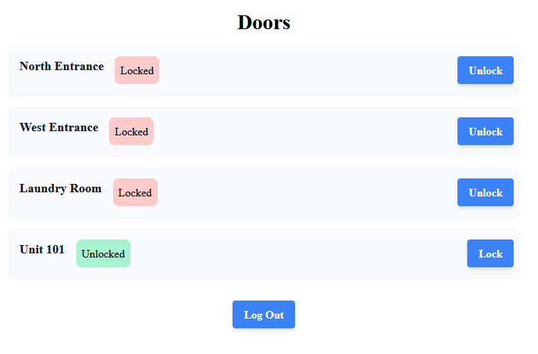

# sugar-quiz

<p align="center">

</p>

**Ragus** is an app for locking and unlocking apartment doors.

## Usage

You can access Ragus at https://sugar-quiz.herokuapp.com. You will need to log in to lock or unlock any doors.

### Login

You can log in as any one of the residents with the following credentials:

- username: Resident email (e.g. annettemoore@dyer-summers.com)
- password: Resident First Name + Last Name (e.g. AdamTaylor)

## Dev Installation

You will need the following tools:

- [Node.js](https://nodejs.org/en/)
- [Python >3.8](https://www.python.org/)
- [Poetry](https://python-poetry.org/)
- [Heroku CLI](https://devcenter.heroku.com/articles/heroku-cli) 

When these tools are installed, run the following commands in this directory:

```
npm install
poetry install
npm run build
```

### Running

Windows:

```
poetry shell
heroku local -f Procfile.windows
```

*nix:

```
poetry shell
heroku local
```

### Debugging

Admin login:

```
user: root
pass: user + 1234
```

Testing:

```
poetry run test
```

You can also run the following commands to ensure code quality:

```
poetry run lint # run flake8 and mypy
poetry run format # run black
```
